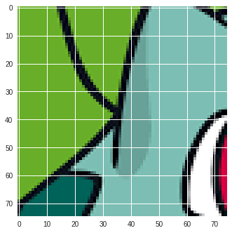
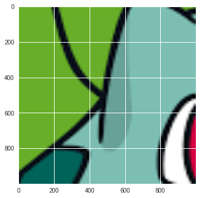

# Eklavya

Eklavya is the image resolution tool which can be used for image resolution enhancement.

      

So there are lot's of image enhancement tool but what so special about this it is an automated tool which can be operated from telegram app. This is just on the go tool which works flawlessly.

### Table of Contents
- [Image Enhancement](#image-enhancement)
- [Tools Used](#tools-used)
- [Installation](#installation)
- [Usage](#usage)

